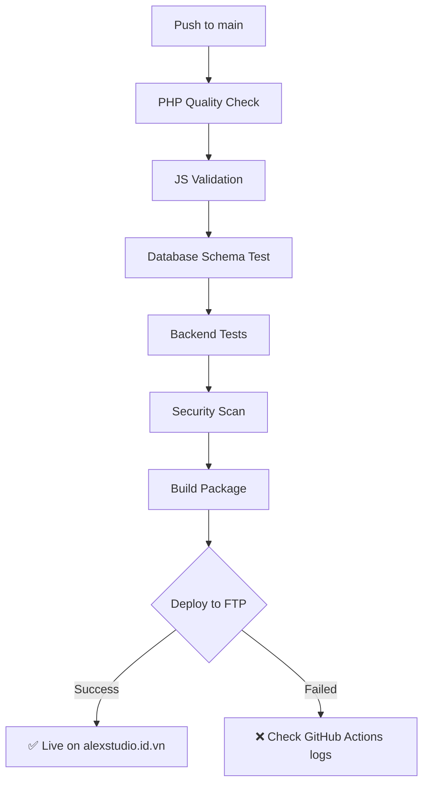

# 🚀 Auto Deployment via GitHub Actions

## Tổng quan

Dự án này sử dụng **GitHub Actions** để tự động deploy lên shared hosting qua FTP sau mỗi lần push code lên branch `main`.

---

## 📋 Quy trình tự động

```
Push to GitHub (main branch)
    ↓
GitHub Actions CI/CD
    ├── PHP Quality Check
    ├── JavaScript Validation
    ├── Database Schema Test
    ├── Backend API Tests
    ├── Security Scan
    ├── Build Package
    └── Deploy via FTP ✅
         ↓
Shared Hosting (alexstudio.id.vn)
```

---

## 🔧 Setup lần đầu

### 1. Thêm GitHub Secrets

Vào: `GitHub Repository → Settings → Secrets and variables → Actions`

Thêm 4 secrets:

| Secret Name       | Value                                     |
| ----------------- | ----------------------------------------- |
| `FTP_SERVER`      | `free02.123host.vn`                       |
| `FTP_USERNAME`    | `myweb@alexstudio.id.vn`                  |
| `FTP_PASSWORD`    | `CEsAL4gY6g`                              |
| `FTP_REMOTE_PATH` | `/home/qeuvbmow/domains/alexstudio.id.vn` |

**📖 Chi tiết:** Xem file `GITHUB_SECRETS_SETUP.md`

---

### 2. Setup Database trên Hosting (Chỉ làm 1 lần)

1. **Vào phpMyAdmin trên hosting**
2. **Tạo database:** `hrm_system`
3. **Import:** Upload file `database/migrations/001_initial_schema.sql`

---

### 3. Cấu hình Database Connection (Chỉ làm 1 lần)

Edit file trên hosting:

```
/home/qeuvbmow/domains/alexstudio.id.vn/app/Config/Database.php
```

Thay đổi:

```php
private $host = "localhost";           // Hosting DB host
private $db_name = "qeuvbmow_hrm";     // Tên database trên hosting
private $username = "qeuvbmow_hrm";    // Username của hosting
private $password = "hosting_password"; // Password của hosting
```

---

## 🎯 Cách sử dụng

### Deploy tự động

```bash
# 1. Sửa code trên local
git add .
git commit -m "feat: new feature"
git push origin main

# 2. Xem deploy progress
# Vào: https://github.com/AlexanderPhan04/HRM/actions
```

### Kiểm tra kết quả

1. **GitHub Actions:**

   - Vào tab `Actions` trên GitHub
   - Click vào workflow đang chạy
   - Xem log chi tiết của từng bước

2. **Website:**

   ```
   https://alexstudio.id.vn
   ```

3. **Login test:**
   - Username: `admin`
   - Password: `admin123`

---

## 📁 Cấu trúc sau Deploy

### Trên Shared Hosting:

```
/home/qeuvbmow/domains/alexstudio.id.vn/
├── app/                          # ✅ Backend (bảo mật - ngoài web root)
│   ├── Config/
│   │   └── Database.php          # ⚠️ Phải cấu hình thủ công
│   ├── Controllers/
│   ├── Models/
│   └── Core/
│
├── database/                     # ✅ SQL migrations (bảo mật)
│   └── migrations/
│       └── 001_initial_schema.sql
│
├── .htaccess                     # ✅ Chặn truy cập từ bên ngoài
│
└── public_html/                  # ✅ Web root (public access)
    ├── api.php                   # ✅ API entry (đã fix paths)
    ├── index.html
    └── assets/
        ├── css/
        └── js/
            ├── app.js
            └── modules/
```

---

## 🔐 Bảo mật

### Files KHÔNG được commit lên GitHub:

- ❌ `FTPHostAccout.md` (đã thêm vào `.gitignore`)
- ❌ `app/Config/Database.php` với credentials thật
- ❌ Bất kỳ file chứa passwords

### Files CHỈ dùng GitHub Secrets:

- ✅ FTP credentials → GitHub Secrets
- ✅ Database passwords → Sửa thủ công trên hosting
- ✅ API keys → Environment variables

---

## 🛠️ Troubleshooting

### ❌ Lỗi: FTP connection failed

**Nguyên nhân:** Sai thông tin FTP

**Giải pháp:**

1. Kiểm tra GitHub Secrets đã thêm đúng chưa
2. Test FTP bằng FileZilla:
   - Host: `free02.123host.vn`
   - Username: `myweb@alexstudio.id.vn`
   - Password: `CEsAL4gY6g`

---

### ❌ Lỗi: Database connection failed

**Nguyên nhân:** Chưa cấu hình `Database.php` trên hosting

**Giải pháp:**

1. Vào File Manager trên hosting
2. Edit: `app/Config/Database.php`
3. Thay đổi host, database name, username, password
4. Save lại

---

### ❌ Lỗi: API 404 Not Found

**Nguyên nhân:** File `api.php` sai paths

**Giải pháp:**

1. Kiểm tra `public_html/api.php` có dòng:
   ```php
   define('ROOT_PATH', dirname(__DIR__)); // Phải lên 1 cấp
   ```
2. GitHub Actions đã tự động tạo file đúng
3. Nếu sai, re-deploy lại

---

### ❌ Lỗi: 403 Forbidden khi truy cập /app/

**Đây là ĐÚNG!** ✅

- Folder `app/` và `database/` ở ngoài `public_html/`
- `.htaccess` đã chặn truy cập từ bên ngoài
- Chỉ `api.php` mới có quyền load files từ `app/`

---

## 📊 CI/CD Pipeline Flow



---

## 📝 Workflow Files

- **Main CI/CD:** `.github/workflows/ci-cd.yml`
- **Jobs:**
  1. ✅ PHP Code Quality
  2. ✅ Vanilla JavaScript Validation
  3. ✅ Database Schema Validation
  4. ✅ Backend API Tests
  5. ✅ Security Scan
  6. ✅ Build & Package
  7. ✅ **Deploy to Production (FTP)** ← Auto deploy

---

## 🎓 Best Practices

### Local Development:

```bash
# 1. Work trên branch feature
git checkout -b feature/new-feature

# 2. Test trên Laragon
# 3. Commit changes
git add .
git commit -m "feat: description"

# 4. Push lên GitHub
git push origin feature/new-feature

# 5. Tạo Pull Request
# 6. Merge vào main → Auto deploy!
```

### Production:

- ✅ Chỉ push vào `main` khi đã test kỹ
- ✅ Xem GitHub Actions logs trước khi test trên live site
- ✅ Có backup database trước khi deploy breaking changes
- ✅ Monitor hosting logs sau mỗi deployment

---

## 📞 Support

Nếu gặp vấn đề:

1. Check GitHub Actions logs
2. Check hosting error logs (File Manager → logs/)
3. Test API endpoints bằng Postman
4. Xem file `GITHUB_SECRETS_SETUP.md` để setup lại

---

**🎉 Chúc deploy thành công!**
